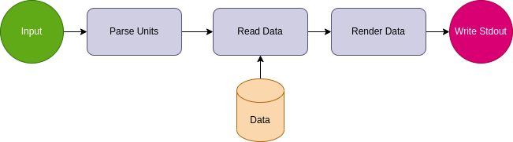
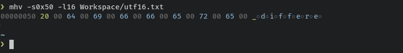
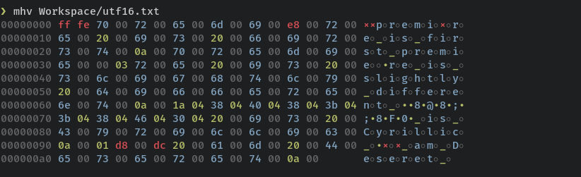

# MHV
<p align="center">
  <a href="https://crates.io/crates/mhv">
    
  </a>
  <a href="https://crates.io/crates/mhv">
    
  </a>
  
  <a href="https://opensource.org/licenses/MIT">
    
  </a>
  <a href="https://github.com/jgardona/mhv/actions/workflows/rust.yml">
    
  </a>
</p>

  <div align="center">
  
  </div>

## How it works?

* **The color legend**
  
  *  ⬛ **Null byte**
  *  🟦 **ASCII Printable Characters**
  *  🟩 **Space Characters**
  *  🟩 **Control Characters**
  *  🟥 **ASCII Extended Codes**
  


* **Install**

```
$ cargo install mhv
```

## Usage

```
❯ mhv -h
A minimalist hex viewer

Usage: mhv [OPTIONS] <FILENAME>

Arguments:
  <FILENAME>  Target file

Options:
  -s, --skip <N>      Skip `N` bytes of the input. The `N` argument can also
                      include an unit (see `--length` for details). [default: 0]
  -l, --length <N>    Read `N` bytes from the input. None for full read. The `N`
                      argument can be a unit with a decimal prefix(kb, mb).
                      Examples: --length 3kb, -l3kb, --length 1mb...
                      N unis are kb(1000), K(1024), mb(1000 * 1000) M(1024 * 1024),
                      and a prefix 0x for hexadecimal, `0x0a`.
  -n, --no-squeezing  Displays all input data. Otherwise any number of output
                      lines which would be identical to the last one are replaced
                      with a line comprised of a single asterisk.
  -h, --help          Print help
  -V, --version       Print versio
```
## Stream Workflow



## Usage examples

* **Read 5 bytes from start**


* **Read 32 bytes from start**


* **Skip 16 bytes and read 40**


* **Read using units kb(1000), K(1024), mb(1000 * 1000) or M(1024 * 1024)**


* **Read from offset 0x50 plus 16 bytes**



* **Read UTF16 file**



