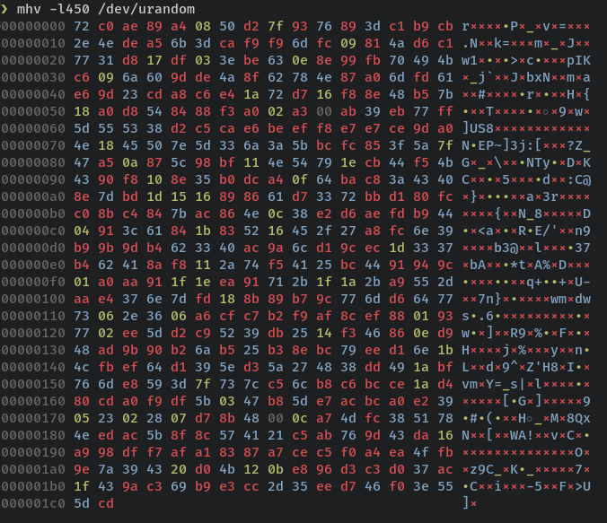
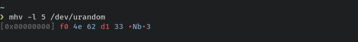
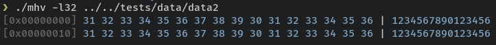
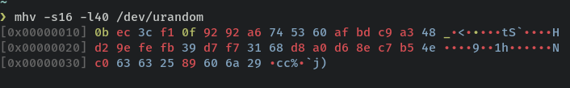

# MHV

<div align="center">

</div>

## **MHV** is a minimalist hexadecimal viewer.

* **The color legend**
  
  *  ⬛ **Null byte**
  *  🟦 **ASCII Printable Characters**
  *  🟩 **Space Characters**
  *  🟩 **Control Characters**
  *  🟥 **ASCII Extended Codes**
  


* **Install**

```
$ cargo install mhv
```

* **Usage**

```
$ mhv --help

A minimalist hex viewer

Usage: mhv [OPTIONS] <FILENAME>

Arguments:
  <FILENAME>  Target file

Options:
  -s, --skip <SKIP>      Skip `n` bytes [default: 0]
  -l, --length <LENGTH>  Read `n` bytes. None for full read
  -h, --help             Print help
  -V, --version          Print version
```

* **Read 5 bytes from start**




* **Read 32 bytes from start**



* **Skip 16 bytes and read 40**


